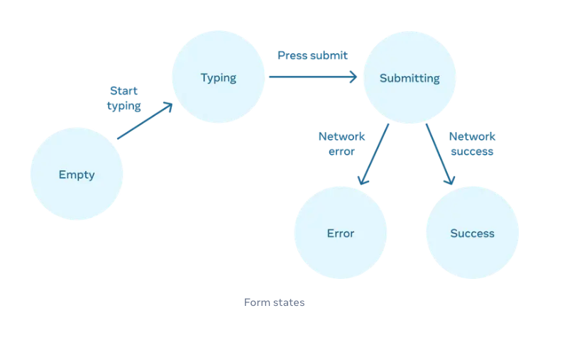
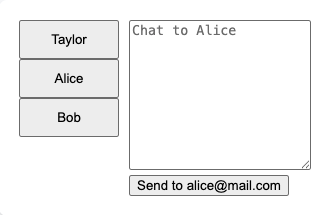

# 3주차 스터디 기록

- 일시 : 2025.05.08
- 참여 인원: 퐁쥬, 머핀, 헤일리, 캉골, 상추, 메타, 해삐

## 목차

- [3주차 스터디 기록](#3주차-스터디-기록)
  - [목차](#목차)
  - [📘 State를 사용해 Input 다루기](#-state를-사용해-input-다루기)
    - [학습 내용](#학습-내용)
  - [📘 State 구조 선택하기](#-state-구조-선택하기)
    - [학습 내용](#학습-내용-1)
  - [📘 컴포넌트 간 State 공유하기](#-컴포넌트-간-state-공유하기)
    - [학습 내용](#학습-내용-2)
    - [💡 토론 내용](#-토론-내용)
  - [📘 State를 보존하고 초기화하기](#-state를-보존하고-초기화하기)
    - [학습 내용](#학습-내용-3)
    - [💡 토론 내용](#-토론-내용-1)
  - [📘 State 로직을 리듀서로 작성하기](#-state-로직을-리듀서로-작성하기)
    - [학습 내용](#학습-내용-4)
  - [📘 Context를 사용해 데이터를 깊게 전달하기](#-context를-사용해-데이터를-깊게-전달하기)
    - [학습 내용](#학습-내용-5)
    - [💡 토론 내용](#-토론-내용-2)
  - [📘 Reducer와 Context로 앱 확장하기](#-reducer와-context로-앱-확장하기)
    - [학습 내용](#학습-내용-6)

## 📘 State를 사용해 Input 다루기

### 학습 내용

📌 명령형 UI 프로그래밍이 아닌 선언형 UI 프로그래밍을 하는 방법

- **명령형 UI 프로그래밍**은 UI의 각 부분을 직접 조작하기 위한 정확한 명령, 방향을 작성하는 것

- **선언형 UI 프로그래밍**은 UI를 직접 조작하지 않고 어떤 UI를 보여주고 싶은지 메시지만 전달하는 것

📌 컴포넌트에 들어갈 수 있는 다양한 시각적 state를 열거하는 방법

- 사용자에게 보여줄 수 있는 (보여주어야 하는) 모든 상태를 파악해서 선언하면 됨

- 💡 리액트를 열거한다는 건?

  - 컴포넌트가 가져야 할 상태를 정의함으로써 컴포넌트가 해당 state들을 인지하게 하는 것

📌 코드에서 다른 시각적 state 간의 변경을 트리거 하는 방법

1. **휴먼 인풋** : 버튼 클릭, input 필드 입력 등을 말함

2. **컴퓨터 인풋** : 네트워크 응답, 타이아웃 등을 말함

➡️ 두 가지 경우를 이용하여 state 변수를 업데이트하면 리액트가 알아서 UI를 렌더링 해줌!

- 폼에 필요한 몇 가지 상태와 그 흐름을 보여줌

  - Empty -> Typing (휴면) : 사용자가 입력 폼에 키보드 타이핑 시작 (트리거)

  - Typing -> Submitting (휴먼) : 입력 완료된 값 요청 (트리거)

  - Submitting -> Error (컴퓨터) : 요청 성공하면 필요한 state 변경 (트리거)

  - Submitting -> Error (컴퓨터) : 요청 실패로 오류 state 변경 (트리거)

    

## 📘 State 구조 선택하기

### 학습 내용

📌 단일 vs 다중 state 변수를 사용하는 경우

- **다중** : 연관되어 있지 않은 필요한 각각의 상태를 모두 만든다.

- **단일** : 연관되어 있는 데이터들은 묶어서 하나의 상태에 객체나 배열로 관리한다.

📌 State를 구성할 때 피해야 할 사항

- 연관된 state 그룹화하기

- 모순된 state 피하기

- 중복 피하기

- 깊게 중첩된 state 피하기

- 불필요한 state 피하기

📌 상태 구조의 일반적인 문제를 해결하는 방법

- 바로 위에서 언급한 **피해야 할 상황**은 피해서 상태를 정의한다.

- 상태를 미러링 하지 말아라

  - useState의 초기값을 설정할 때 받아온 props로 설정하지 말아라
    ```js
    function Message({ initialColor }) {
      const [color, setColor] = useState(initialColor); // ❌ => props로 받는 값은 유동적으로 바뀌기 때문에 초기값으로 쓰면 유지되어야 할 초기값이 계속 바뀐다.
    }
    ```

## 📘 컴포넌트 간 State 공유하기

### 학습 내용

📌 State 끌어올리기를 통해 컴포넌트 간 state를 공유하는 방법

- 공통으로 사용되야 하는 state를 가장 가까운 공통 부모에 선언해서 props로 내려준다.

  - 다른 방법으로 Context API도 있다.

📌 제어 컴포넌트와 비제어 컴포넌트

- 제어와 비제어는 **부모가 자식을 제어할 수 있는지 없는지가 기준**이 된다.

- **제어 컴포넌트**

  - 부모가 props로 자식을 변경시킬 수 있는 경우를 말한다. <- 부모가 자식을 제어할 수 있다.

- **비제어 컴포넌트**

  - 자식이 직접 state를 가지고 있는 경우 ← 부모가 제어하지 않는다.

### 💡 토론 내용

❓ 리액트 공식 문서에서 이야기하고 있는 제어/비제어 컴포넌트와 useRef 개념을 다룰 때 이야기하는 제어/비제어 컴포넌트는 다른가?

- 공식 문서에서 이야기하는 제어/비제어 컴포넌트와 useRef 개념에서 사용하는 제어/비제어 컴포넌트의 개념은 좀 다르다!

- 공식 문서가 이야기하는 제어/비제어 컴포넌트는 상태의 소유권이 어디 있는지(자식 vs 부모)에 대한 것!

- useRef 개념에서 제어/비제어 컴포넌트는 DOM에서 관리되는지 React의 state에 의해 관리되는지를 이야기 함!

➡️ "상태가 어디서 관리되는지"에 대해 이야기하는 건 동일하지만 맥락에 따라 다루는 정보가 다른 느낌?!

## 📘 State를 보존하고 초기화하기

### 학습 내용

📌 React가 언제 state를 보존하고 언제 초기화하는지

- 컴포넌트가 Render 트리에 있으면 state를 보존하고, 컴포넌트가 Render 트리에서 빠지면 state를 초기화한다.

📌 어떻게 React가 컴포넌트의 state를 초기화하도록 강제할 수 있는지

- 다른 위치에 컴포넌트를 렌더링한다.

- 각 컴포넌트에 명시적인 key 값을 부여한다.

- 컴포넌트 타입을 다르게 한다.

- 조건부 렌더링으로 작성한다.

📌 key와 타입이 state 보존에 어떻게 영향을 주는지

- **타입**

  - 동일한 위치에 다른 type의 컴포넌트가 위치하면 React는 다른 컴포넌트라고 취급하고 state를 초기화한다.

    (💡 여기서 이야기하는 type은 컴포넌트 자체(이름 -> `<Counter>`을 의미한다.))

- **key**

  - 동일한 위치에 다른 key값을 가진 컴포넌트가 렌더링되면, React는 서로 다른 컴포넌트라고 취급하고 state를 초기화한다.

### 💡 토론 내용

❓ 그럼 여기서 렌더 트리 내에서 식별자의 비교 순서는 어떻게 될까?

- key -> index -> type

❓ 컴포넌트의 state를 보존하는데 있어서 삼항 연산자와 && 연산자의 차이는?

- **삼항 연산자** : 무조건 하나의 컴포넌트만 나오기 때문에 하나의 컴포넌트로 인식한다. → 다르게 하고 싶으면 key로 분리하면 됨

- **&&** : 서로 개별로 나타날 수도 있고 아닐 수도 있음 → 서로 다른 컴포넌트로 인식 → 렌더 트리에서의 위치가 다름

❓chat 실습에서 메시지 내용 입력 후 다른 인물의 이름을 클릭했을 때 메시지가 초기화 되도록 하려면?

- key 값을 넘긴다.

❓ 인물 각각의 메시지가 유지되도록 하려면?

- 개별의 메시지 값을 유지하기 위해 인물들의 이름과 메시지 내용을 담는 상태를 부모로 끌어올린다.

  (사람들의 정보를 하나의 객체로 관리하는 방향..! 하나의 상태에 사람들의 이름 & 메시지를 관리)

- 추가로, person이라는 useState 상태를 선언해서 지금 어떤 인물이 클릭되었는지를 관리한다.

- 각 버튼 눌렸을 때 사람 이름을 setter 함수로 변경해서 해당 상태가 들고 있는 메시지 들고와서 입력창에 표시해준다.

```js
export default function Messenger() {
  const [to, setTo] = useState(contacts[0]);
  return (
    <div>
      <ContactList
        contacts={contacts}
        selectedContact={to}
        onSelect={(contact) => setTo(contact)}
      />
      <Chat contact={to} />
    </div>
  );
}

const contacts = [
  { id: 0, name: "Taylor", email: "taylor@mail.com" },
  { id: 1, name: "Alice", email: "alice@mail.com" },
  { id: 2, name: "Bob", email: "bob@mail.com" },
];
```



## 📘 State 로직을 리듀서로 작성하기

### 학습 내용

📌 reducer 함수란 무엇인가

- reducer 함수는 컴포넌트 내에 분산되어 있는 상태 업데이트 로직을 한 곳으로 모으기 위해 컴포넌트 외부에 작성하는 단일 함수이다.

- 여러 개의 state 로직에 대한 핸들러가 있다면 컴포넌트 밖에서 함수로(reducer) 선언해서 관리할 수 있다.

- useState를 고급지게 쓸 수 있게 해주는 함수이다.

- 무조건 사용할 필요는 없다. 기본적으로는 일반 setter 함수를 사용하되 setter에 대한 로직이 복잡하거나 너무 많으면 reducer로 관리하면 좋음!

📌 useState에서 useReducer로 리팩토링 하는 방법

1. 상태 설정을 action dispatch로 변경하기

2. reducer 함수 작성하기

3. 컴포넌트에서 reducer 사용하기

📌 reducer를 언제 사용할 수 있는지

- 하나의 상태가 여러 핸들러 함수에 의해 업데이트 될 경우

- 하나의 함수에서 통합해서 관리하고 싶을 때

- setter 과정이 복잡할 때

- 명령형에서 선언형으로 작성하고 싶을 때

📌 reducer를 잘 작성하는 방법

- 렌더링 중에 수행되기 때문에 reducer는 순수해야 한다.

- 사이드 이펙트가 발생하면 안된다.

- 각 action은 여러 변경이 있어도, 하나의 상호작용을 설명해야 한다.

  - ex) reducer가 관리하는 5개의 input form에 대해 "초기화" 버튼에 대한 동작을 수행한다고 했을 때 5개의 개별 action을 정의하기보다는 입력 폼 5개를 한번에 초기화시켜주는 action 1개를 두는 게 좋다.

## 📘 Context를 사용해 데이터를 깊게 전달하기

### 학습 내용

📌 ”Prop drilling” 이란?

- 자식에게 여러 단계에 걸쳐 연속해서 props를 계속 넘기는 것

- 중간자 컴포넌트가 단지 전달자 역할만 하게 될 수 있다.

📌 Context로 반복적인 prop 전달 대체하기

1. context 생성하기

2. context 사용하기

3. context 제공하기

4. 사용할 컴포넌트에 provider 감싸기

📌 Context의 일반적인 사용 사례

- 테마 지정 (다크 모드 & 화이트 모드)

- 현재 계정 (로그인한 사용자 정보를 알아야 하는 컴포넌트가 많을 수 있음)

- 라우팅

  - 대부분의 라우팅 솔루션은 현재 경로를 유지하기 위해 내부적으로 context를 사용한다. → 실제 라우팅 라이브러리가 context로 만들어져있다.

- 상태 관리

📌 Context의 일반적인 대안

- children 활용

  - 중간자 컴포넌트 없이 바로 내부 컴포넌트가 받아서 사용할 수 있음

  - 하지만, 추상화는 안됨 (컴포넌트 구조 노출됨)

### 💡 토론 내용

❓ deps가 깊다고 생각하는 기준은 얼마일까?

- 중간자가 껴있을 때

- 3-4 or 4-5 단계

❓ props를 하나로 넘겨주는 게 힘들때는?

- props 스프레드 문법을 사용해 볼 수 있다. (`...props`)

  - 장점 : 한번에 넘길 수 있다.

  - 단점

    - props 스프레드 활용은 내부에 어떤 속성이 들어있는지 확인 불가하다.

    - 불필요한 상태도 넘어갈 수 있다고 생각한다.

## 📘 Reducer와 Context로 앱 확장하기

### 학습 내용

📌 reducer와 context를 결합하는 방법

1. Context 생성

2. State과 dispatch 함수를 context에 넣기

3. 트리 안에서 context 사용하기

📌 state와 dispatch 함수를 prop으로 전달하지 않는 방법

- state와 dispatch 함수를 context 파일에 넣는다.

  - 이렇게 하면 props drilling 없이 context를 불러와서 읽을 수 있다.

📌 context와 state 로직을 별도의 파일에서 관리하는 방법

- context와 state 관련 reducer 로직을 하나의 파일로 묶기
